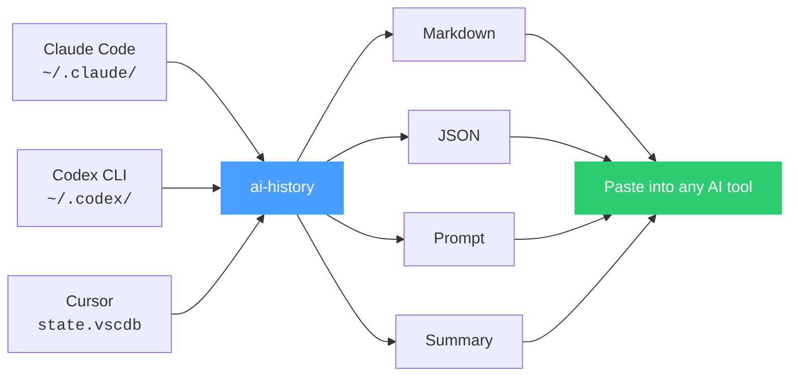
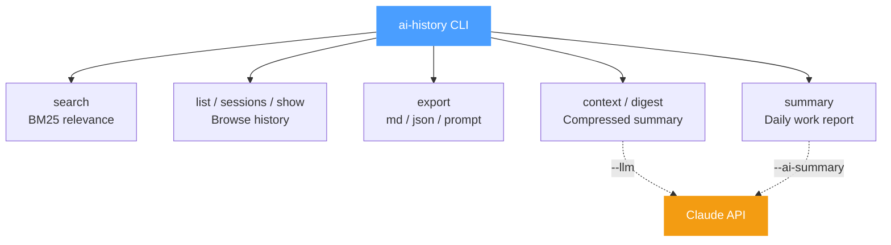
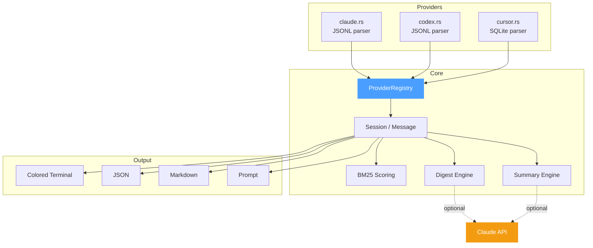
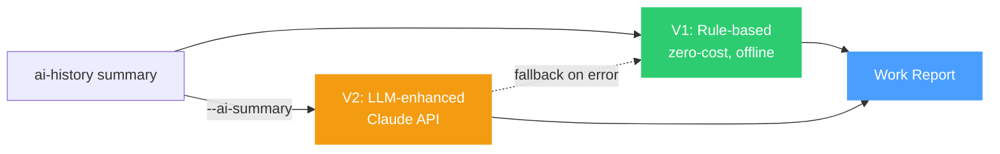

# ai-history

[中文文档](README_CN.md)

---

Local memory for AI coding sessions.

`ai-history` searches your local **Claude Code**, **Codex CLI**, and **Cursor** chat history, then turns past sessions into clean context you can reuse in a new AI coding session.

If you keep re-explaining the same bug, architecture, or codebase decisions to different AI assistants, this is the missing memory layer.

- Works with Claude Code, Codex CLI, and Cursor
- Runs locally by default: no upload, no telemetry, no account
- Generates compact digests instead of dumping huge transcripts
- Installs a `/ai-history` slash command for Claude Code and Codex CLI

[Launch write-up](https://github.com/jiantao88/ai-history/discussions/1) · [Demo script](docs/demo-script.md) · [Release checklist](docs/release-checklist.md)

## 10-second demo

```console
$ ai-history search "auth bug" -n 3
1. codex  myapp   2026-05-21  Fix OAuth callback regression
2. cursor myapp   2026-05-18  Investigate stale token cache
3. claude myapp   2026-05-12  Refactor auth middleware

$ ai-history context 2026-05-21-fix-oauth-callback
# Session Digest: Fix OAuth callback regression

## Intent
Fix an OAuth redirect loop after the callback route changed.

## Key Decisions
- Keep callback validation in `auth/callback.ts`.
- Do not move token refresh into middleware.

## Code Changes
- Updated redirect URI handling.
- Added regression coverage for stale token cache.
```

Paste the digest into a fresh AI session and continue from yesterday's context instead of rebuilding it from memory.

## Why this exists

Every AI coding session starts from zero. Your assistant does not remember yesterday's decisions, debugging steps, or architectural tradeoffs. The history exists on your machine, but it is scattered across provider-specific storage formats.

`ai-history` reads chat history from multiple AI tools and makes it available anywhere — as a slash command inside Claude Code or Codex, or as a CLI tool you can pipe into any workflow.

## Privacy model

`ai-history` is local-first.

- Reads local history files from Claude Code, Codex CLI, and Cursor.
- Does not upload your chat history.
- Does not collect telemetry.
- Does not require a hosted account.
- Optional LLM enhancement only runs when you pass `--llm` or `--ai-summary` and provide an Anthropic-compatible API key.

## Installation

### One-line install (recommended)

Run this in your terminal, or just tell your AI assistant to run it:

```bash
curl -fsSL https://raw.githubusercontent.com/jiantao88/ai-history/master/setup | bash
```

No Rust, no build tools required — the script downloads a pre-built binary for your platform (macOS ARM64/Intel, Linux x86_64) and installs the `/ai-history` slash command for Claude Code and Codex CLI.

For release hygiene and package-manager follow-ups, see the [release checklist](docs/release-checklist.md).

### From source (for developers)

```bash
git clone https://github.com/jiantao88/ai-history.git
cd ai-history
cargo install --path .
./setup                  # install skills only (binary already built)
```

## Features

- **Search**: BM25-ranked search across all supported providers.
- **Browse**: list projects, sessions, and full conversations.
- **Context**: export a session as a compact digest for a new AI session.
- **Export**: Markdown, JSON, and clean prompt formats.
- **Summary**: generate a daily work report across AI sessions.

## How it works



## CLI map



## Architecture



See also: [interactive architecture diagram](docs/architecture.html)

## Use in Claude Code

After installation, use `/ai-history` in any Claude Code session:

```
/ai-history                              # list all projects
/ai-history sessions myproject           # list sessions
/ai-history show <session-id>            # view a conversation
/ai-history search "keyword"             # search across all history
/ai-history context <session-id>         # load digest (compressed summary)
/ai-history context <session-id> --full  # load full conversation
/ai-history context-search "keyword"     # search + auto-load best match
/ai-history digest <session-id>          # generate standalone digest
```

## Use in Codex CLI

After installation, use `/ai-history` in any Codex session:

```
/ai-history                              # list all projects
/ai-history sessions myproject           # list sessions
/ai-history search "keyword"             # search across all history
/ai-history context <session-id>         # load digest from a past session
/ai-history context <session-id> --full  # load full conversation
```

## Use as CLI

You can also use `ai-history` directly in the terminal:

```bash
ai-history list                                    # list projects
ai-history sessions myproject                      # list sessions (fuzzy match)
ai-history show <session-id> --compact             # user/assistant only
ai-history search "auth bug" -n 10                 # search
ai-history context <session-id>                    # digest (compressed summary)
ai-history context <session-id> --full             # full conversation
ai-history digest <session-id>                     # standalone digest
ai-history digest <session-id> --llm               # LLM-enhanced digest
ai-history today . --titles                        # today's work titles for current project
ai-history workflows --days 30                     # repeated workflow candidates
ai-history export <session-id> --format prompt     # export for pasting
ai-history export <session-id> --format md         # Markdown export
ai-history export <session-id> --format json       # JSON export
```

### Today (Project Worklog)

Aggregate today's sessions for one project across all available providers by default: Claude Code, Codex CLI, and Cursor. This command is fully rule-based and does not call an LLM.

```bash
ai-history today                                   # current directory, summary view
ai-history today . --titles                        # title list
ai-history today . --summary                       # detailed rule-based summary
ai-history today . --json                          # JSON worklog entries
ai-history today . --titles --json                 # compact title JSON
ai-history today . --date 2026-06-03 --titles      # specific local date
ai-history today . --provider codex --titles       # limit to one provider
```

### Summary (Work Report)

Generate a daily work summary across all AI sessions:

```bash
ai-history summary                                 # today's summary
ai-history summary myproject                       # filter by project
ai-history summary --date 2026-05-20               # specific date
ai-history summary --range 2026-05-19..2026-05-21  # date range
ai-history summary --ai-summary                    # LLM-enhanced summary
ai-history summary --json                          # JSON output
```



Output example:

```
AI WORK SUMMARY — 2026-05-21
══════════════════════════════════════════════════════════════════
Sessions: 5    Messages: 452    Active time: ~7h 52m
──────────────────────────────────────────────────────────────────
#   Time           Msgs  Type      Summary
1   09:19-09:31      42  开发      修复iOS动态视频封面旋转90度的问题
2   11:00-12:40      87  优化      排查ScrollView内Touch替换为Pressable
3   12:42-14:40     119  代码审查  审查项目代码变更
4   16:58-17:36      18  新功能    探索并提出ai-history日报总结功能需求
5   17:40-21:30     186  新功能    实现ai-history summary功能
══════════════════════════════════════════════════════════════════
```

### Workflows (Reusable Workflow Mining)

Review recent AI work and identify repeated manual workflows that may be worth packaging as a skill, subagent, automation, or an extension of an existing asset. By default, this scans all available providers: Codex, Claude Code, and Cursor. Use `--provider <id>` to limit the report to one provider.

By default this is report-only. It never writes skills unless you explicitly select candidate IDs with `--write-skills --skill <id>`.

```bash
ai-history workflows                               # last 30 days
ai-history workflows rnproject                     # filter by project
ai-history workflows --days 14                     # custom lookback window
ai-history workflows --range 2026-04-27..2026-05-27
ai-history workflows --json

# Write selected missing candidates as skill drafts
ai-history workflows --write-skills --skill rn-screenshot-code-fix
ai-history workflows --write-skills --skill rn-screenshot-code-fix --skills-dir ~/.codex/skills
```

Output includes the repeated workflow, evidence dates, frequency/confidence, recommended form, existing skill coverage, and whether it is worth creating.

### LLM Configuration

The `--llm` (digest) and `--ai-summary` (summary) features require a Claude API key. Configure via environment variables:

```bash
# Official Anthropic API
export ANTHROPIC_API_KEY="sk-ant-..."

# Or use a custom proxy
export ANTHROPIC_BASE_URL="https://your-proxy.example.com"
export ANTHROPIC_AUTH_TOKEN="your-token"    # uses Bearer auth
export ANTHROPIC_MODEL="claude-sonnet-4-6"  # override model (default: claude-haiku-4-5)
```

| Variable | Description |
|----------|-------------|
| `ANTHROPIC_API_KEY` | API key (uses `x-api-key` header) |
| `ANTHROPIC_AUTH_TOKEN` | Alternative token (uses `Authorization: Bearer` header, takes priority over `ANTHROPIC_API_KEY`) |
| `ANTHROPIC_BASE_URL` | Custom API endpoint (default: `https://api.anthropic.com`) |
| `ANTHROPIC_MODEL` | Model to use for LLM features (default: `claude-haiku-4-5-20251001`) |

Session IDs support prefix matching — type `a247accc` instead of the full UUID.

### Search Options

```bash
ai-history search "query" -n 20             # limit results
ai-history search "query" -C 2              # show 2 context messages around each match
ai-history search "auth login" --all        # require all terms (AND mode)
ai-history search "query" --sort-time       # sort by time instead of relevance (BM25)
```

### Global Options

```bash
--json                 # Force JSON output (auto-detected when piped)
--provider claude      # Filter to specific provider
--provider claude,codex,cursor
```

### Pipe-Friendly

Output auto-switches to JSON when piped:

```bash
ai-history export <id> --format prompt | pbcopy           # clipboard
ai-history list --json | jq '.[] | select(.provider == "cursor")'
```

## Export Formats

| Format | Flag | Best For |
|--------|------|----------|
| Prompt | `--format prompt` | Pasting into another AI tool — clean `User:` / `Assistant:` blocks, no noise |
| Markdown | `--format md` | Documentation, sharing — includes metadata and tool calls |
| JSON | `--format json` | Programmatic use — full structured message data |

## Supported Providers

| Provider | Data Location | Notes |
|----------|--------------|-------|
| Claude Code | `~/.claude/projects/{encoded-path}/*.jsonl` | Full support |
| Codex CLI | `~/.codex/sessions/**/rollout-*.jsonl` | Uses file mtime when timestamps missing |
| Cursor | `~/Library/Application Support/Cursor/User/globalStorage/state.vscdb` (macOS) | Scans global database for all workspaces |

### Provider Implementation Details

**Codex**: When session files lack timestamps in JSONL, falls back to file modification time for accurate time-based filtering in `summary` command.

**Cursor**: Reads from the global database (`globalStorage/state.vscdb`) instead of per-workspace databases. Uses `workspaceIdentifier` field to map composers to workspaces. Scans ~800 composers in ~60ms using optimized SQL queries with `json_extract` and `json_array_length`.

## Adding a New Provider

1. Create `src/provider/<name>.rs` implementing the `Provider` trait
2. Add `pub mod <name>;` in `src/provider/mod.rs`
3. Register in `build_registry()`

## License

MIT
