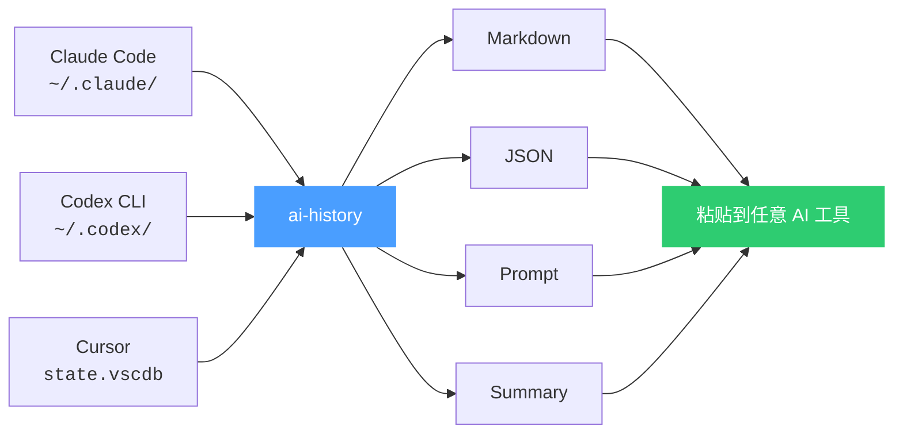
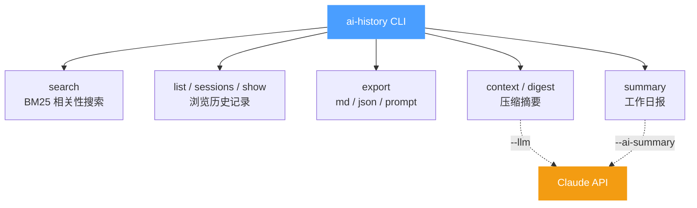
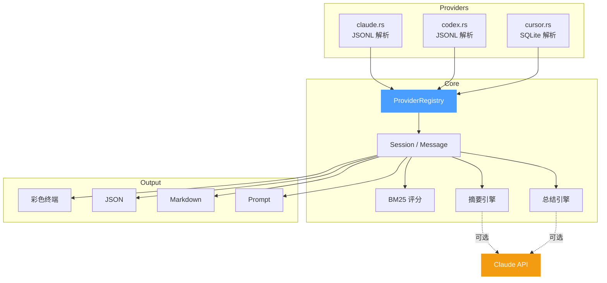
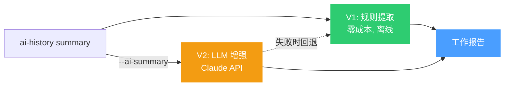

# ai-history

[English](README.md)

---

跨 AI 编程助手共享聊天记录。搜索 **Claude Code**、**Codex CLI** 和 **Cursor** 的历史对话，然后注入到当前会话的上下文中。

## 问题

每次 AI 会话都从零开始。助手不记得昨天做了什么决定、调试了什么 bug、选择了什么架构方案。你不得不一遍又一遍地重复解释相同的上下文。

## 解决方案

`ai-history` 读取多个 AI 工具的聊天记录，让你可以在任何地方使用它们——作为 Claude Code 或 Codex 中的斜杠命令，或者作为可以管道到任何工作流的 CLI 工具。



## 功能概览



## 架构



查看交互式架构图：[docs/architecture.html](docs/architecture.html)

## 安装

### 一键安装（推荐）

在终端运行，或者直接告诉你的 AI 助手执行：

```bash
curl -fsSL https://raw.githubusercontent.com/jiantao88/ai-history/master/setup | bash
```

不需要 Rust，不需要编译——脚本会自动下载适合你平台的预编译二进制文件（macOS ARM64/Intel、Linux x86_64），并安装 Claude Code 和 Codex CLI 的 `/ai-history` 斜杠命令。

### 从源码安装（开发者）

```bash
git clone https://github.com/jiantao88/ai-history.git
cd ai-history
cargo install --path .
./setup                  # 仅安装 skills（二进制已编译）
```

## 在 Claude Code 中使用

安装后，在任意 Claude Code 会话中使用 `/ai-history`：

```
/ai-history                              # 列出所有项目
/ai-history sessions myproject           # 列出会话
/ai-history show <session-id>            # 查看对话
/ai-history search "关键词"               # 搜索所有聊天记录
/ai-history context <session-id>         # 加载摘要（压缩版上下文）
/ai-history context <session-id> --full  # 加载完整对话
/ai-history context-search "关键词"       # 搜索并自动加载最相关的会话
/ai-history digest <session-id>          # 生成独立摘要
```

## 在 Codex CLI 中使用

安装后，在任意 Codex 会话中使用 `/ai-history`：

```
/ai-history                              # 列出所有项目
/ai-history sessions myproject           # 列出会话
/ai-history search "关键词"               # 搜索所有聊天记录
/ai-history context <session-id>         # 加载历史会话摘要
/ai-history context <session-id> --full  # 加载完整对话
```

## 作为 CLI 使用

也可以直接在终端使用 `ai-history`：

```bash
ai-history list                                    # 列出项目
ai-history sessions myproject                      # 列出会话（模糊匹配）
ai-history show <session-id> --compact             # 仅 user/assistant
ai-history search "认证 bug" -n 10                 # 搜索
ai-history context <session-id>                    # 摘要（压缩版上下文）
ai-history context <session-id> --full             # 完整对话
ai-history digest <session-id>                     # 独立摘要
ai-history digest <session-id> --llm               # LLM 增强摘要
ai-history export <session-id> --format prompt     # 导出用于粘贴
ai-history export <session-id> --format md         # Markdown 导出
ai-history export <session-id> --format json       # JSON 导出
```

### 工作总结（日报）

生成按时间范围聚合的 AI 工作总结报告：

```bash
ai-history summary                                 # 今天的总结
ai-history summary myproject                       # 按项目过滤
ai-history summary --date 2026-05-20               # 指定日期
ai-history summary --range 2026-05-19..2026-05-21  # 日期范围
ai-history summary --ai-summary                    # LLM 增强摘要
ai-history summary --json                          # JSON 输出
```



输出示例：

```
AI WORK SUMMARY — 2026-05-21
══════════════════════════════════════════════════════════════════
Sessions: 5    Messages: 452    Active time: ~7h 52m
──────────────────────────────────────────────────────────────────
#   Time           Msgs  Type      Summary
1   09:19-09:31      42  开发      修复iOS动态视频封面旋转90度的问题
2   11:00-12:40      87  优化      排查ScrollView内Touch替换为Pressable
3   12:42-14:40     119  代码审查  审查项目代码变更
4   16:58-17:36      18  新功能    探索并提出ai-history日报总结功能需求
5   17:40-21:30     186  新功能    实现ai-history summary功能
══════════════════════════════════════════════════════════════════
```

### LLM 配置

`--llm`（digest）和 `--ai-summary`（summary）功能需要 Claude API key。通过环境变量配置：

```bash
# 官方 Anthropic API
export ANTHROPIC_API_KEY="sk-ant-..."

# 或使用自定义代理
export ANTHROPIC_BASE_URL="https://your-proxy.example.com"
export ANTHROPIC_AUTH_TOKEN="your-token"    # 使用 Bearer 认证
export ANTHROPIC_MODEL="claude-sonnet-4-6"  # 指定模型（默认: claude-haiku-4-5）
```

| 环境变量 | 说明 |
|----------|------|
| `ANTHROPIC_API_KEY` | API 密钥（使用 `x-api-key` 头） |
| `ANTHROPIC_AUTH_TOKEN` | 替代令牌（使用 `Authorization: Bearer` 头，优先于 `ANTHROPIC_API_KEY`） |
| `ANTHROPIC_BASE_URL` | 自定义 API 端点（默认：`https://api.anthropic.com`） |
| `ANTHROPIC_MODEL` | LLM 功能使用的模型（默认：`claude-haiku-4-5-20251001`） |

Session ID 支持前缀匹配——输入 `a247accc` 无需完整 UUID。

### 搜索选项

```bash
ai-history search "查询" -n 20             # 限制结果数量
ai-history search "查询" -C 2              # 每个匹配显示前后 2 条上下文消息
ai-history search "认证 登录" --all        # 要求所有词都匹配（AND 模式）
ai-history search "查询" --sort-time       # 按时间排序而非相关性（BM25）
```

### 全局选项

```bash
--json                 # 强制 JSON 输出（管道时自动切换）
--provider claude      # 过滤特定 provider
--provider claude,codex,cursor
```

### 管道友好

管道输出时自动切换为 JSON：

```bash
ai-history export <id> --format prompt | pbcopy           # 复制到剪贴板
ai-history list --json | jq '.[] | select(.provider == "cursor")'
```

## 导出格式

| 格式 | 参数 | 适用场景 |
|------|------|----------|
| Prompt | `--format prompt` | 粘贴到其他 AI 工具——干净的 `User:` / `Assistant:` 对话块，无噪音 |
| Markdown | `--format md` | 文档、分享——包含元数据和工具调用 |
| JSON | `--format json` | 程序化使用——完整的结构化消息数据 |

## 支持的 Provider

| Provider | 数据路径 |
|----------|---------|
| Claude Code | `~/.claude/projects/{编码路径}/*.jsonl` |
| Codex CLI | `~/.codex/sessions/**/rollout-*.jsonl` |
| Cursor | `~/Library/Application Support/Cursor/User/workspaceStorage/*/state.vscdb`（macOS） |

## 添加新 Provider

1. 创建 `src/provider/<name>.rs`，实现 `Provider` trait
2. 在 `src/provider/mod.rs` 中添加 `pub mod <name>;`
3. 在 `build_registry()` 中注册

## 许可证

MIT
